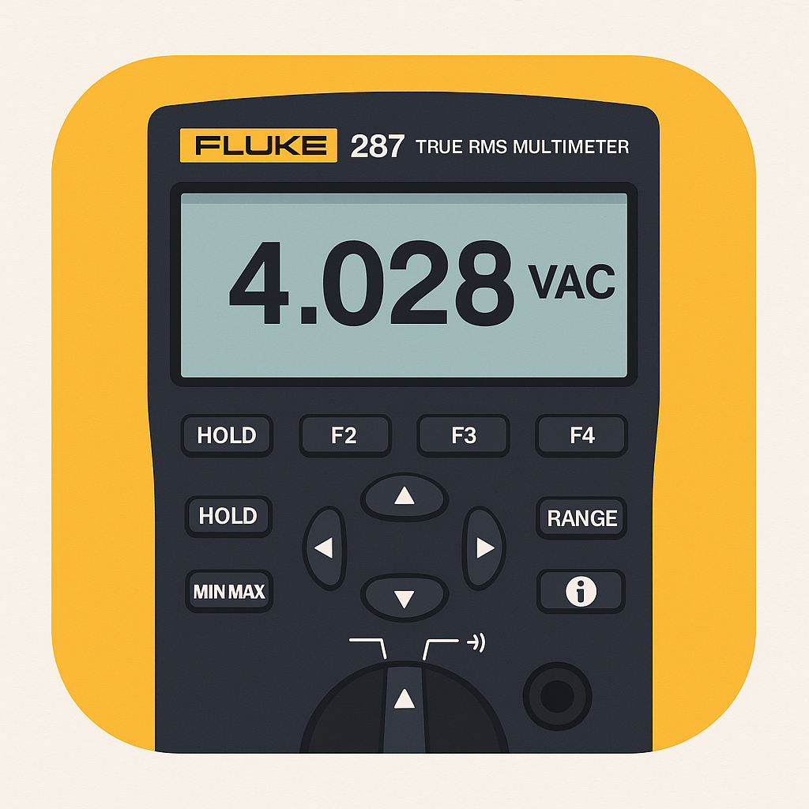
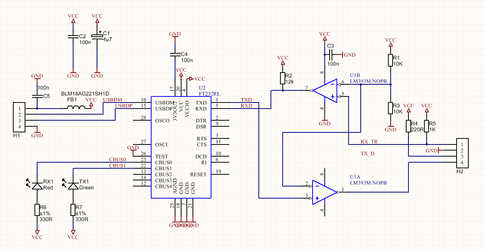
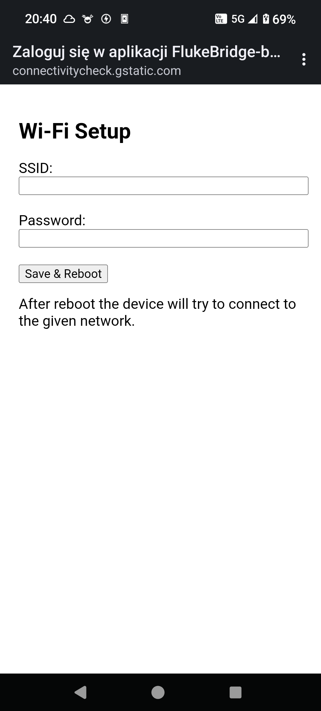
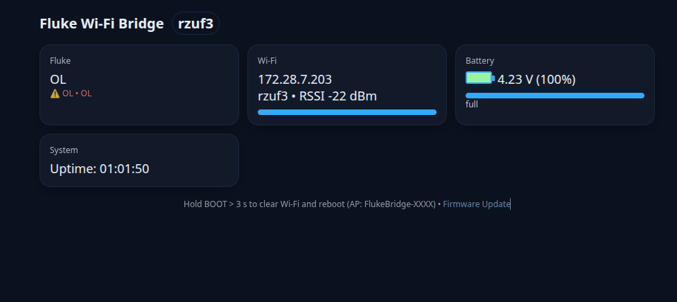
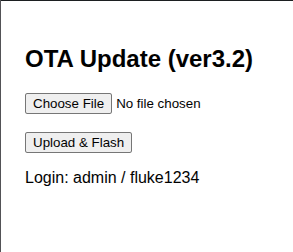

# 🧭 Fluke Bridge Wi‑Fi Adapter
Wireless bridge for Fluke 287/289 multimeters with live dashboard, HTTP API, and OBS integration

## 📘 Overview

Important: This project is designed and tested specifically for the Seeed Studio XIAO ESP32‑C3. Pinout (RX=20, TX=21, LED=GPIO3), BOOT behavior, and battery heuristics assume this board. Other ESP32 variants may require pin and wiring changes.

Fluke Bridge is a compact Wi‑Fi adapter based on Seeed XIAO ESP32‑C3, designed to connect a Fluke 287/289 multimeter through its infrared serial interface (LM393) and stream live measurements via a modern web dashboard or directly into OBS.

The project enables:

- 📡 Wireless measurement streaming (Voltage, Current, Resistance, Temperature, Capacitance, Diode Test)
- 💻 Real‑time dashboard — dark themed web interface at `http://fluke-bridge.local`
- 🎥 OBS integration via local text files
- ⚙️ OTA firmware update directly from browser
- 🔋 Battery monitoring with LED indication
- 📶 Automatic Wi‑Fi setup via captive portal
- 🔄 USB fallback mode when Wi‑Fi is not configured

<p>
  
</p>

## 🧩 Hardware

| Component | Function | Notes |
|-----------|----------|-------|
| Seeed XIAO ESP32‑C3 | MCU + Wi‑Fi | Tiny module with USB‑C |
| LM393 IR transceiver | Interface to Fluke optical port | RX=GPIO20, TX=GPIO21, non‑inverted |
| Li‑ion 18650 cell | Power supply | via protection board |
| DW01A + 8205A | Battery protection | B+/B− to cell, P+/P− to ESP |
| GPIO3 LED | Battery status indicator | ON = low batt, blink = critical |
| BOOT button | Long press = Wi‑Fi reset | same button as XIAO BOOT |
| RESET button | Restart device | standard |

<p>
  
</p>

## 🔋 Battery Indicator Logic

| Battery State | Voltage | LED Behavior (GPIO3) |
|---------------|---------|----------------------|
| No battery / PCM cutoff | < 1.0 V | OFF |
| Normal | > 3.45 V | OFF |
| Low | 3.30 – 3.45 V | ON steady |
| Critical | < 3.30 V | Blinking |
| USB connected | — | OFF |

## 🌐 Network Operation

### 1️⃣ Initial Setup (AP mode)
If no Wi‑Fi credentials exist:
- ESP starts its own AP: SSID: `FlukeBridge‑XXXX`
- Open any browser → automatic captive portal
- Enter SSID + password → ESP reboots into client mode

<p>
  
</p>

### 2️⃣ Normal Operation (Client mode)
When connected:
- Accessible via mDNS → `http://fluke-bridge.local`
- Endpoints:
  - `/` → index page with links
  - `/status.html` → dashboard (dark mode)
  - `/status.json` → live JSON API
  - `/update` → OTA firmware upload panel (ver3.2)

<p>
  
</p>

## ⚙️ OTA Firmware Update (ver3.2)

1. In Arduino IDE → Sketch → Export compiled binary
2. Open browser: `http://fluke-bridge.local/update`
3. Upload the `.ino.bin` file (application binary)
4. Wait for message and auto‑reboot

Notes:
- Use the app binary `<sketch>.ino.bin` (do not upload merged/with_bootloader images via OTA).
- Settings in Preferences (Wi‑Fi SSID/pass) remain intact across OTA.

<p>
  
</p>

## 🔌 USB Serial Mode (fallback)

If Wi‑Fi is not configured:
- ESP32‑C3 communicates directly with Fluke over USB CDC.
- Use the Python tool `pc/fluke_read.py` with `--serial`.
- When Wi‑Fi is configured later, continue using HTTP (`/status.json`).

## 📡 JSON API — `/status.json`

Example:

```json
{
  "wifi": { "ssid": "rzuf3", "rssi": -29, "ip": "172.28.7.203" },
  "battery": {
    "voltage": 4.38,
    "percent": 100,
    "usb_present": false,
    "warn": false,
    "crit": false,
    "charging": false,
    "full": true,
    "no_batt": false
  },
  "fluke": {
    "pretty": "22.6 °C",
    "value": "22.6",
    "unit": "CEL",
    "status": "NORMAL",
    "flags": "NONE",
    "ol": false,
    "raw": "22.6,CEL,NORMAL,NONE"
  },
  "uptime": 234
}
```

### Fields Reference

| Field         | Description                      |
|---------------|----------------------------------|
| `wifi.*`      | Wi‑Fi connection info            |
| `battery.*`   | Battery telemetry                |
| `fluke.pretty`| Human‑friendly formatted value   |
| `fluke.value` | Raw numeric                      |
| `fluke.unit`  | Measurement unit                 |
| `fluke.status`| Meter status (e.g., NORMAL, CONT, DIODE) |
| `fluke.ol`    | True if overload (OL)            |
| `uptime`      | Seconds since boot               |

## 🧠 Firmware Features

| Feature            | Description                                   |
|--------------------|-----------------------------------------------|
| Auto Wi‑Fi setup   | Captive portal + preferences storage          |
| HTTP server        | `/`, `/status.json`, `/update`                |
| Async dashboard    | Auto‑refresh via AJAX                         |
| mDNS support       | Access as `fluke-bridge.local`                |
| Battery ADC monitor| Percentage + LED logic                        |
| IR UART            | 115200 baud, RX=20, TX=21 (non‑inverted)      |
| OTA Update         | Native OTA via `Update.h` (ver3.2)            |
| BOOT long‑press    | Wi‑Fi reset (clear NVS + Preferences)         |
| Dark theme UI      | Consistent design                             |
| Failsafe USB       | Automatic serial fallback                     |

## 🐍 Python Tool — `fluke_read.py`

Features
- Works with both HTTP (Wi‑Fi) and USB serial
- Saves data for OBS overlays
- Detects status: LIVE, HOLD, OL, OFF
  - Note: this computed status is produced by the Python tool logic; the firmware JSON exposes the meter status, not LIVE/HOLD/OL/OFF directly.

Usage
```
# HTTP (Wi‑Fi)
python3 pc/fluke_read.py --http http://fluke-bridge.local/status.json

# USB (fallback)
python3 pc/fluke_read.py --serial /dev/ttyACM0
```

Options

| Flag          | Description                    |
|---------------|--------------------------------|
| `--http <url>`| Use HTTP mode                  |
| `--serial <p>`| Use serial mode (USB CDC)      |
| `--tcp h:p`   | Optional TCP bridge mode       |

Output files

| File              | Purpose                           |
|-------------------|-----------------------------------|
| `fluke_value.txt` | Measured value (pretty, 1 line)   |
| `fluke_status.txt`| Status (LIVE / HOLD / OL / OFF)   |

## 🎥 OBS Integration

In OBS add two Text sources (Read from file):
- `fluke_value.txt` → measurement
- `fluke_status.txt` → status

Then run (prefers HTTP, falls back to USB):
```
cd pc
./run_obs_with_fluke.sh
```

Values refresh about every second.

## 🛠 Dependencies

- Arduino IDE and esp32 board (v3.0+)
- Libraries: `WiFi.h`, `WebServer.h`, `Preferences.h`, `DNSServer.h`, `ESPmDNS.h`, `Update.h`
- Python 3 with `pyserial` for USB mode: `pip install pyserial`

## 🧾 Version History

| Version | Features                           |
|---------|------------------------------------|
| 0.1     | Basic serial bridge                |
| 1.0     | Wi‑Fi TCP bridge                   |
| 2.0     | HTTP JSON API                      |
| 3.0     | Dashboard + battery logic          |
| 3.1     | OL handling fix + mDNS             |
| 3.2     | OTA + dual Wi‑Fi/USB mode          |

## 🚀 Release (tag + draft on GitHub)

Use the helper script to generate the checksum and print the git commands:

```
cd github
bash tools/release.sh 3.2
```

This will create `SHA256SUMS.txt` and show the exact `git add/commit/tag/push` steps. Pushing the tag `v3.2` triggers GitHub Actions to create a draft Release with:
- `FlukeBridge-ver3.2-XIAO-ESP32C3.bin`
- `SHA256SUMS.txt`

You can then publish the Release from the GitHub UI.

## 🧰 Troubleshooting

| Symptom            | Fix                                                |
|--------------------|----------------------------------------------------|
| No setup AP        | Hold BOOT > 3 s to clear Wi‑Fi and reboot          |
| Dashboard 404      | Open `/` (root) or `/status.html` directly         |
| OBS shows OFF      | Check `fluke.status` and USB/HTTP connectivity     |
| OL shown as 9.99e37| Update firmware ≥ 3.1                              |
| OTA failed         | Ensure stable Wi‑Fi and battery; retry or USB flash|
| USB flash fails    | Hold BOOT while plugging in to enter bootloader    |

## ⚡ License

MIT License (permissive). See LICENSE.

© 2025 Andrzej Jabłoński / AudioSzum.pl

## 📁 Repository Structure (this folder)

- `pc/fluke_read.py` – host script: reads from HTTP `/status.json` or USB; writes text for OBS.
- `pc/run_obs_with_fluke.sh` – starts the Python script (HTTP with fallback to USB) and OBS.
- `FlukeBridge-ver3.2-XIAO-ESP32C3.bin` – prebuilt firmware image for OTA/USB flashing (ver3.2).
- `docs/images/*.png` – screenshots used in this README, plus IR schematic.
- `LICENSE`, `CHANGELOG.md`, `.gitignore`, `README.md` – project metadata.

Note: Firmware sources are included under `firmware/`. If you prefer flashing a prebuilt image, upload `FlukeBridge-ver3.2-XIAO-ESP32C3.bin` via the device’s OTA page.

## 🛠 Build and Upload (USB)

1) Open `firmware/ver3.2/ver3.2.ino` (or `ver3.1`) in Arduino IDE.
2) Select board: Seeed Studio XIAO ESP32‑C3 (ESP32‑C3 core v3.0+). Upload via USB‑C.

## 🎥 Run with OBS on the host

- `cd pc && ./run_obs_with_fluke.sh`
- The script probes HTTP (`/status.json`); if unavailable, it falls back to USB (`/dev/ttyACM0`).

## 🔁 Wi‑Fi Reset (BOOT)

- Hold BOOT (> 3 s). Device clears Wi‑Fi credentials (NVS + Preferences), restarts into AP mode with captive portal.
